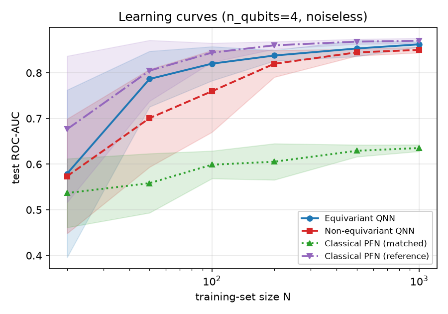
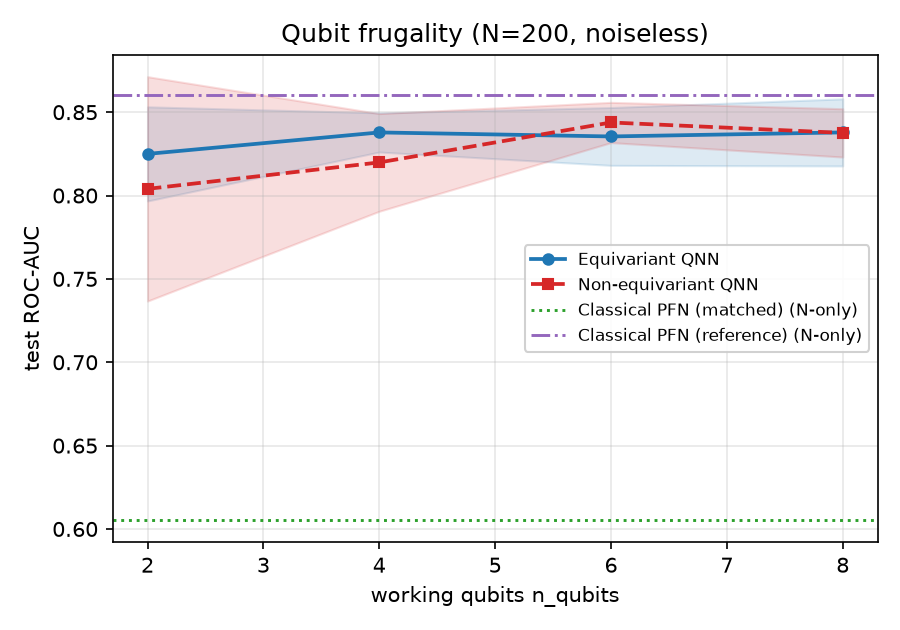
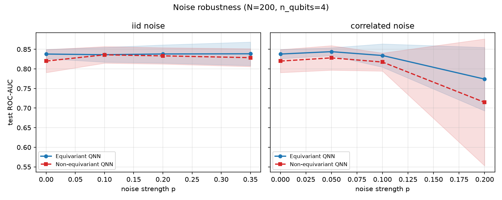
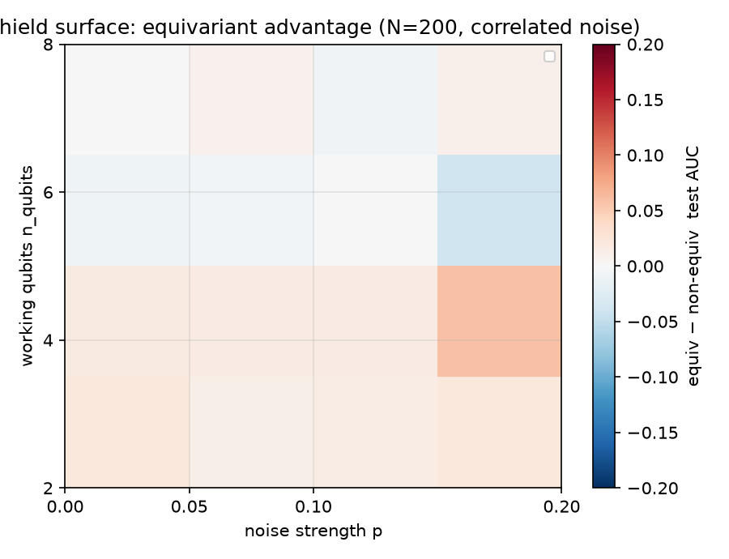
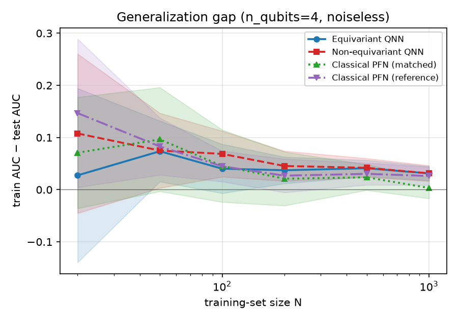
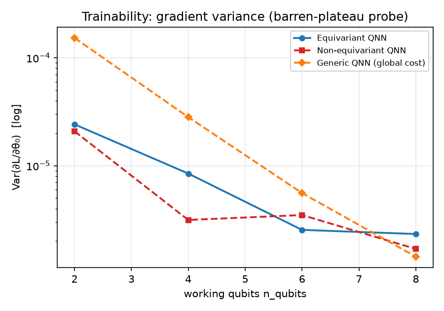

# qgnn-triple-shield

A reproducible experiment testing whether a **permutation-equivariant** quantum graph/set
network for jet tagging acts as a **triple shield** against three stresses applied at once:

1. **Few training samples (N)** — does the symmetry-restricted hypothesis class generalize from less data?
2. **Few qubits (n_qubits)** — does the equivariant model stay useful at 2–4 working qubits where a matched non-equivariant model collapses?
3. **More noise (p)** — does the equivariant model degrade more gracefully, especially under temporally-correlated noise?

We compare three models on JetNet binary jet tagging (gluon vs top):

- **Equivariant quantum tagger** — shared per-particle circuit + symmetric pool (Quantum Deep Sets).
- **Non-equivariant control** — same circuit but with positional encoding and concatenated readout, matched in total parameters.
- **Classical PFN/Deep-Sets** baseline.

We sweep `(N, n_qubits, noise) × {model}`, with 10–20 stratified replicates per cell, and report
test ROC-AUC plus a barren-plateau gradient-variance diagnostic.

## Results at a glance

840 training runs across the sweep. Full interpretation in **[RESULTS.md](RESULTS.md)**.

**Headline:** at *equal parameter budget* the equivariant model beats the non-equivariant
control on data efficiency and correlated-noise robustness; a larger unconstrained classical
network remains the ceiling. The "triple shield" holds in part — reported honestly.

| Stress axis | Result |
|---|---|
| Data efficiency (vs N) | 🟢 equivariant leads at every N≥50 (N=50: **0.786 vs 0.701**) |
| Generalization gap | 🟢 4× smaller at N=20 (**0.027 vs 0.108**) |
| Qubit frugality | 🟡 holds **0.825 AUC at 2 qubits**, but control doesn't collapse |
| Correlated noise | 🟢 degrades more gracefully (p=0.2: **0.774 vs 0.715**) |
| Trainability | 🟢 generic global-cost ansatz decays ~107× vs equivariant ~10× |

### 1. Learning curves — data efficiency


### 2. Qubit frugality


### 3. Noise robustness (iid vs correlated)


### 4. Shield surface — equivariant advantage over qubits × correlated noise


### 5. Generalization gap


### 6. Trainability — barren-plateau probe


## Status

All modules built and validated locally (CPU). Data loader, equivariant +
non-equivariant + classical models, noise models, trainer (with random restarts),
gradient-variance diagnostic, config-driven sweep, and plotting are complete.

## How to run (local CPU — primary)

Runs on a CPU box (developed on Windows 11, i5-14400F / 32 GB). Quantum circuits use
PennyLane `default.qubit` (noiseless / correlated noise) and `default.mixed` (iid
noise) with `backprop` — far faster than `lightning.qubit`+`adjoint` for our many
tiny circuits over large constituent batches. **NumPy is pinned `<2`** (jetnet →
energyflow → wasserstein). On Windows set `PYTHONUTF8=1` (jetnet's progress bar).

```bash
python -m venv .venv && .venv\Scripts\python -m pip install -r requirements.txt
python scripts/check_data.py            # JetNet load: shapes + class balance
python tests/test_loader_logic.py       # preprocessing unit tests (numpy only)
python tests/test_invariance.py         # permutation invariance (eq) vs not (control)
python tests/test_overfit.py            # training plumbing + quantum grad flow
python experiments/sweep.py --grid smoke --workers 8     # ~3 min end-to-end
python experiments/sweep.py --grid full  --workers 9     # ~3.5-4 h, resumable (cached)
python experiments/run_diagnostics.py                    # barren-plateau curves
python analysis/plots.py                                 # all figures -> results/figures/
```

The sweep writes one JSON per config to `results/cache/` keyed by a config hash;
re-running **skips finished configs**, so a killed run resumes for free. After ANY
change to trainer/model/noise config, clear `results/cache/*.json` (stale reuse).

## Colab / Kaggle

`notebook.ipynb` is a platform-aware entry point (auto-installs deps, mounts Drive on
Colab, runs the data check / tests / smoke / plots). The full sweep is best run from a
terminal. `data/paths.py` resolves writable dirs per platform.

## Experimental design (why OAT, not full cross-product)

The literal `N x n_qubits x noise x model` grid is infeasible: iid noise needs the
density-matrix simulator (`default.mixed`, cost ~4^n) so nq=8 iid ≈ 7 h **per config**.
Since every target figure is a 1-D slice, the sweep uses a **One-Axis-At-a-Time**
design anchored at `nq=4, N=200, noiseless`: a learning-curve block (vary N), a qubit
block (vary n_qubits), a noise block (vary p; iid kept to nq≤4, correlated to nq=8),
and a bonus 2-D `n_qubits x correlated-noise` "shield surface". 600 configs, ~3.5-4 h.

## Repo layout

```
qgnn-triple-shield/
  config.yaml            # all experiment knobs (grids, seeds, models, noise, training)
  requirements.txt
  notebook.ipynb         # platform-aware entry (setup/data/tests/smoke/plots)
  data/
    paths.py             # platform detection (local/Kaggle/Colab) + writable dirs
    loader.py            # JetNet -> (X, mask, y), subsampling, leakage-free standardizer
  models/
    quantum_equiv.py     # equivariant Quantum Deep Sets (shared circuit + masked-mean pool)
    quantum_noneq.py     # non-equivariant control (A1: positional encoding, budget-matched)
    classical_pfn.py     # Particle Flow Network / Deep Sets baseline
    quantum_generic.py   # deep global-cost ansatz (barren-plateau comparator, diagnostic-only)
    noise.py             # iid (amplitude damping) + correlated OU RX noise; trajectory averaging
  train/
    trainer.py           # Adam + early stop + random restarts (stuck-init escape); metrics
    diagnostics.py       # gradient-variance (barren-plateau) probe
  experiments/
    sweep.py             # OAT block grid, per-config cache, process-pool parallelism
    run_diagnostics.py   # compute + save gradient-variance curves
  analysis/
    plots.py             # the 5 payoff figures + shield-surface heatmap (PNG + CSV)
  scripts/               # check_data, check_noise, check_train_diag (eyeball demos)
  results/               # cached per-config JSON + parquet/csv + figures (gitignored)
  tests/                 # loader logic, permutation invariance, overfit/grad-flow
```

## Reproducibility contract

- One global seed in `config.yaml`; per-cell seeds derived deterministically from
  `(global_seed, N, replicate_index)` via `numpy.random.SeedSequence`.
- Each sweep result is keyed by a SHA1 hash of its config dict; reruns skip cached cells.
- The test set is fixed across all sweep cells (depends only on global seed + n_test).
- Standardizer is fit on the train portion only (no val/test leakage).
- Note: float results depend slightly on CPU thread count; sweep workers pin `threads=1`.
